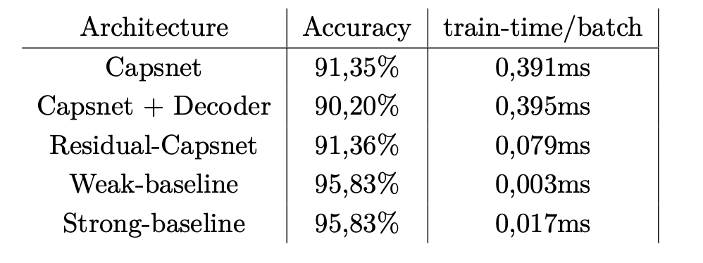
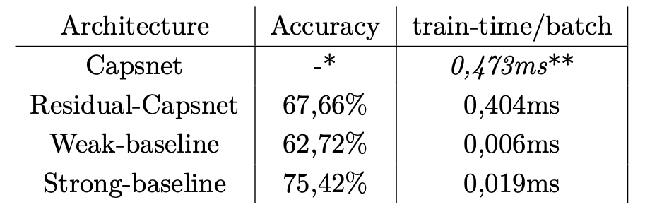

# Residual Capsule Network - PyTorch
PyTorch implementation of a matrix capsule network [2] with residual blocks as head for successful training on more complex data (STL-10).

## Introduction
This has been part of my [Masters thesis](https://github.com/MarkusFox/residual-capsnet/blob/master/MASTERARBEIT_62276.pdf) [1]. Check the full document for more details.

Five implementations were evaluated:
- Capsnet: reproduced version of matrix capsule network [2].
- Capsnet + Decoder: Same as above but with simple 3 layer reconstruction network added.
- Residual-Capsnet.
- Weak-baseline: very basic 3 layer CNN similar to AlexNet [3].
- Strong-baseline: ResNet50 [4].

## Performance
### smallNORB classification:

### STL10 classification:

<i>*network did not converge and fluctuated around random accuracy of 10%. 
**due to high memory consumption we had to set batch size to 2 for this architecture.</i>

# References
[1] Fox, M. (2020). Object Recognition with Mask R-CNN and Capsule Networks. 
[2] Hinton, G. E., Sabour, S., and Frosst, N. (2018). Matrix capsules with em routing. 
[3] Krizhevsky, A., Sutskever, I., and Hinton, G. E. (2012). Imagenet classification with deep convolutional neural networks. 
[4] He, K., Zhang, X., Ren, S., and Sun, J. (2016). Deep residual learning for image recognition.

# Acknowledge
https://github.com/yl-1993/Matrix-Capsules-EM-PyTorch

# License
[Apache License 2.0](./LICENSE)
